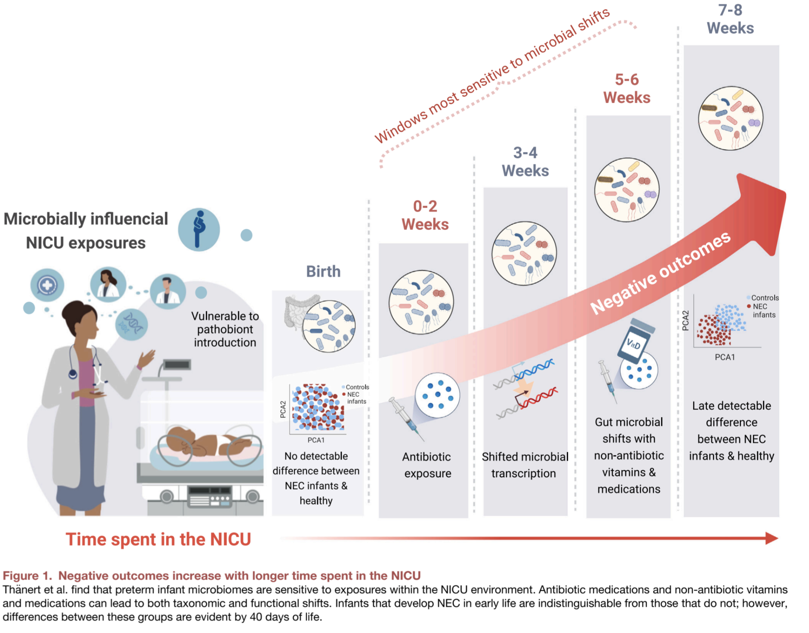

A little on our recent publication:

Hospitalization throws the preterm gut microbiome off-key
======
Last month I was invited to work on a preview paper with Dr. Mathew Olm and Jing Qian. I was new to the format, but essentially a preview is a short, wider audiance-friendly report of soon to be published research with important findings. In our case, we aimed to showcase the really cool work of [Thanert et al](https://doi.org/10.1016/j.chom.2024.07.027), which utlized nifty metagenomics and metatranscriptomics techniques to uncover the influence if medical interventions in neonatal intensive care units (NICUs) on gut microbiome dynamics in the first months of infant life. 

Why is this important?
------
Well infants in the NICU are going through enough as is! These infants have usually been born prematurely, or have other life-threatening medical complications to fend off. The last thing they need are interventions that don't optimaize for the healthy developement of microbial communities within them. 

We know that the gut microbiome is shaped in the early months of our lives, with long-lasting implications in our health. Research like this helps us understand what procedures are and are not beneficial for cultivating these symbiotic microbial relationships in the infant gut. 

Below is a figure we made to illustrate this idea, but the preview is [now out](https://doi.org/10.1016/j.chom.2024.09.009) too. 

