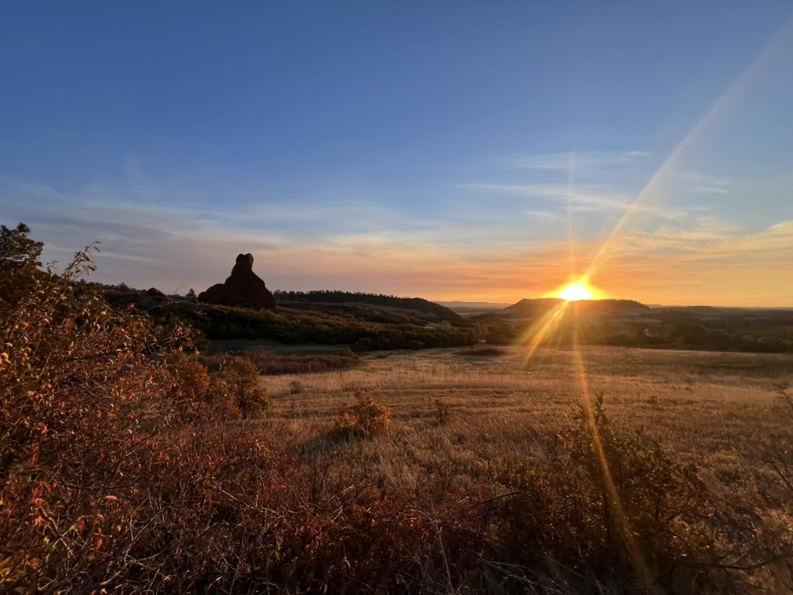

Many Miles in the Woods :

Indian Creeks 50-miler - Oct 12th
======

A first official 50 miler race. Won't be my last! What a day. 

I chose this race mainly because it was close to Boulder, it was not that expensive to enter, and the trails looked pretty. That's basically it. In hind sight, I should have perhaps considered that the race was 2 weeks before my comprehensive exam and I may have been a little on edge for that. But I think it was just what I needed actually. 

Running is like that for me. So much of my academic planning, ideas and solutions are stumbled across in my brain whilst running. It's probably why I don't feel guilty for spending so much of my time running, even when there is a lot of work to do. I've heard people make similar comments regarding a meditation routine. 

Max dropped me off at the race for a 6am kickoff. Starting a run in the dark always makes me excited, just knowing I'll be in the prime seat for the sunrise (see above). I don't know how time passed so quickly during this race, but it did. I even brought earphones expecting to finish my audiobook, but it didn't once cross my mind to listen to something. I had also packed all sorts of gels and bars, but ended up eating whatever nutella tortillas, mandrins, crisps, or gummy bears were laid out on the aid stations. So much for a "fuelling plan". 

All was going fairly well until mile 45. At this point I told myself I had 5 miles to go and that seemed easy enough. Well until I foud out there was an extra 3.5 mile detour down and right back up the mountain to the finish. This was ROUGH. It's so interesting how your mental state determines so much of your physical. Because I was mentally "done", and my body started to feel that way too. Side note, I was facinated by this topic (and still am) during my undergraduate degree and siged up as a volunteer for a study looking at just this:

Venhorst, A., Micklewright, D.P. & Noakes, T.D. [The Psychophysiological Regulation of Pacing Behaviour and Performance Fatigability During Long-Distance Running with Locomotor Muscle Fatigue and Exercise-Induced Muscle Damage in Highly Trained Runners.](https://link.springer.com/article/10.1186/s40798-018-0143-2?fromPaywallRec=true#citeas) Sports Med - Open 4, 29 (2018)

But back to the 50 miler. I came in nearly 12 hours later. Max ran the last half mile with me (at rapid speeds haha), and I smiled the whole drive home ... already thinking about what to enter next. 